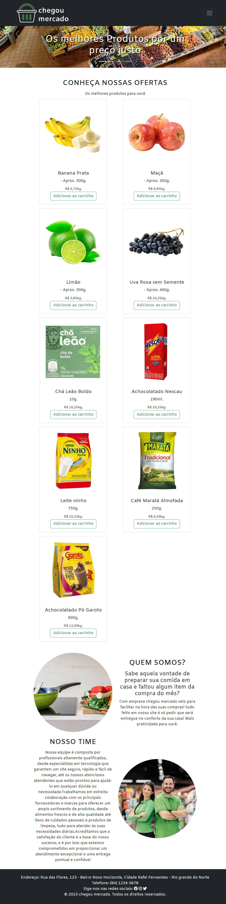

<h1 align="center">Chegou Mercado</h1>

 O projeto Chegou Mercado, é página onde é possível solicitar produtos de mercado com um clique, resolvendo problemas onde cliente ao realizar compras tenah que se deslocar, e ao finalizar suas compras dependendo do horário poderá encontrar filas enormes, perdendo seu tempo válioso ali.

<h4 align="center">	Projeto foi finalizado sendo uma página simples.</h4>

## 🛠 Tecnologias
As seguintes ferramentas foram usadas na construção do projeto:
- [HTML](https://developer.mozilla.org/pt-BR/docs/Web/HTML)
- [CSS](https://developer.mozilla.org/pt-BR/docs/Web/CSS)
- [Bootstrap](https://getbootstrap.com/)

## 🎨 Layout

### Mobile

  

### Web

  

